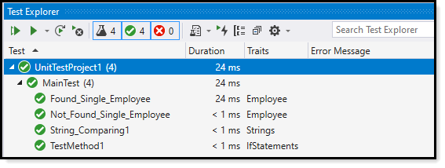

# About


This unit test project provides a well-structured framework for creating unit test.

A unit test project usually test methods in other projects, in this case everything is self contained for ease of getting started with unit testing.

:heavy_check_mark: Basic unit test framework

:heavy_check_mark: Base folder has partial classes and base classes

:red_circle: Self-contained (some classes would be in their own projects)

## View of Test Explorer

</br>

:heavy_check_mark: Note `Traits`, refer to code under Base folder

</br>



---


# Recommendations

Try out [Shouldly](https://www.nuget.org/packages/Shouldly/) for assertions installed via NuGet.

```
<TestMethod>
<TestTraits(Trait.ShouldlyNewtonSoft)>
Public Sub IsJsonArray()
	ReadJsonArrayFromFile.IsJsonArray().ShouldBeTrue()
End Sub
<TestMethod>
<TestTraits(Trait.ShouldlyNewtonSoft)>
Public Sub IsJsonSingleObject()
	ReadJsonObjectFromFile.IsJsonArray().ShouldBeFalse()
End Sub

```